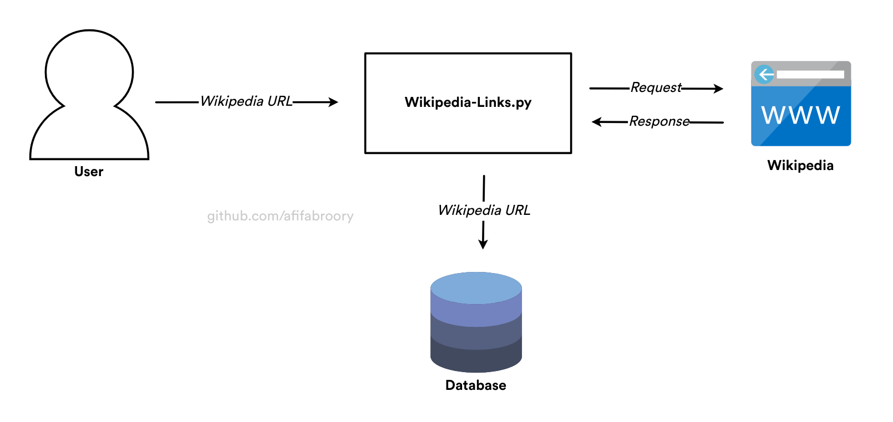

# Wikipedia Links (DISCOUNTINUE)

This project is the base project for the "Wikipedia article network graph modeling" project.

In short, this project is for extracting links in the Wikipedia article and store links relationship into database. 

> *Important to know, the main design goal for this project is to model network graph relationships on specific topics only!*

The architecture of this project is too trivial to discuss or to show. But for the sake of documentation, here is the project architecture

## Project Technologies
I am gonna use Python for the language and **???** for the database.

- Why Python? Because it's simple to use. So, I can focus on solving problems.
- Research is needed to decide which database I am gonna use.

## Some Notes
*About UI and application type.* The important part of the "Wikipedia article network graph modeling" project is a good User Interfaces. Because the data are extracted every time user input a *Wikipedia URL* manually. Having a good UI is better. For the sake of cross-platform I will choose a Web based application.

*About automation and data.* It's possible to extract automatically every time the program found URL from the lexical analysis. In that case, the relationship could be uncontrolled, because it will get anything the program found. This are also harmful for Wikipedia!
